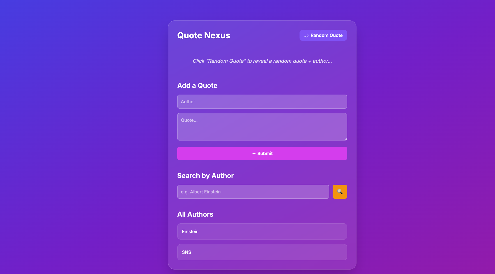

This is the backend for my quote generator web app hosted at. 
It uses FastAPI to query to a PostGreSQL database hosted on render.. 

➡️➡️ HOSTED AT: https://paddygregory.com/ ⬅️⬅️

Features Include:

- Adding personal Quotes + Authorship
- Searching for quotes based on author
- Generating a random quote

Backend built through python you can find on backend.py

contact:
reach me @ paddygregory62@gmail.com or @paddygreg0ry on X.

